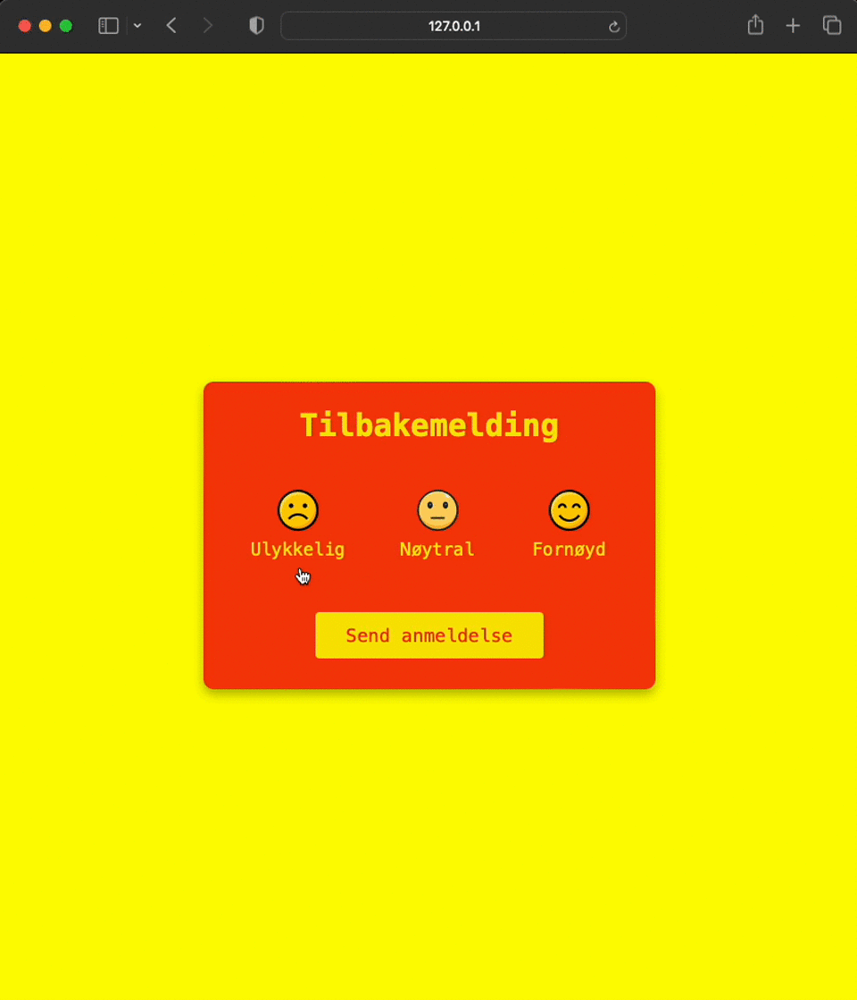

<h1>Here are the feedback facilities for a site. 
Text written in Norwegian can be translated into English as follows</h1>

<h5>Tilbakemelding - Feedback</h5>
<h5>Ulykkelig - Unhappy</h5>
<h5>Neutral - Neutral</h5>
<h5>Fornøyd - Satisfied</h5>
<h5>Send anmeldelse - Send feedback</h5>
<h5>Takk! - Thanks!</h5>
<h5>Vi bruker tilbakemeldingen din til å forbedre kundestøtten vår. - We'll use your feedback to improve our customer support.</h5>

<h2>HTML, CSS and JavaScript were combined in the project.</h2>

<h2>Graphics Interchange Format</h2>

